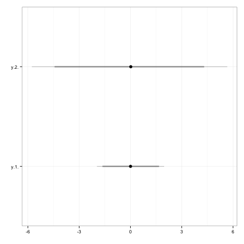

StanCat
===

Version 0.1

This package has one simple function: `stan_caterpillar`. It creates
caterpillar plots for posterior distributions in `stanfit` objects created
with [Stan](http://mc-stan.org/).

You use regular expressions to identify the parameters, so that you can easily
plot a number of parameters using very compact code.

## Example

First run your Stan model as usual:


```r
# Create Stan model
library(rstan)

rstan_options(auto_write = TRUE)
options(mc.cores = parallel::detectCores())

scode <- "
    parameters {
        real y[2];
    }
    model {
        y[1] ~ normal(0, 1);
        y[2] ~ double_exponential(0, 2);
    }
"

# Run
fit <- stan(model_code = scode, iter = 10000, verbose = FALSE)
```

We can then use
[regular expressions](http://stat.ethz.ch/R-manual/R-devel/library/base/html/regex.html)
to identify all of the parameters that we want to plot. `y\\[.*\\]` in the
example below identifies both the **y[1]** and **y[2]** parameters.

Note that `\\[` and `\\]` are needed to include the square brackets as the
square brackets in the Stan model, rather than as the special `[]` regular
expressions brackets.


```r
StanCat::stan_caterpillar(fit, pars = 'y\\[.*\\]')
```

 


## Install

Use devtools to install the package:


```r
devtools::install_github('christophergandrud/StanCat')
```
